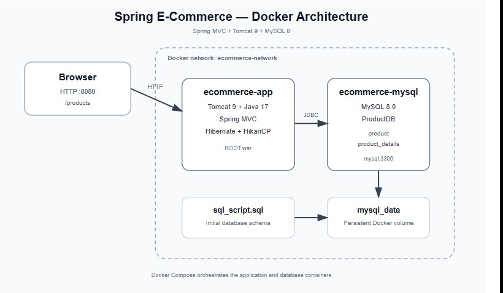

# Spring E-Commerce Application — Dockerized

A Spring MVC e-commerce application containerized with Docker and integrated with MySQL using Docker Compose.

> **Important:** The original Java application source code was not modified for the Dockerization. Database connection settings are supplied through environment variables already supported by `HibernateConfig.java`.

## Architecture



```text
Browser
   |
   | HTTP :8080
   v
Spring MVC Application
Tomcat 9 + Java 17
   |
   | JDBC
   | mysql:3306
   v
MySQL 8
   |
   v
ProductDB
   ├── product
   └── product_details
```

The containers communicate over the private Docker network `ecommerce-network`.

## Technology Stack

- Java 17
- Maven
- Spring Framework 5.3.30
- Spring MVC
- Hibernate 5.6.15
- HikariCP
- MySQL 8.0
- Apache Tomcat 9
- Docker
- Docker Compose

## Project Structure

```text
spring-ecommerce-app/
├── database/
│   └── sql_script.sql
├── docs/
│   └── architecture.jpg
├── src/
├── .dockerignore
├── .env
├── .env.example
├── .gitignore
├── Dockerfile
├── docker-compose.yml
├── pom.xml
└── README.md
```

## Prerequisites

Install Docker and the Docker Compose plugin:

```bash
docker --version
docker compose version
```

No local Java, Maven, or MySQL installation is required to run the application.

## Configuration

Create `.env` in the project root:

```env
MYSQL_DATABASE=ProductDB
MYSQL_USER=ecommerce
MYSQL_PASSWORD=ecommerce_password
MYSQL_ROOT_PASSWORD=root_password

HIBERNATE_DRIVER=com.mysql.cj.jdbc.Driver
HIBERNATE_URL=jdbc:mysql://mysql:3306/ProductDB?useSSL=false&allowPublicKeyRetrieval=true&serverTimezone=UTC
HIBERNATE_DIALECT=org.hibernate.dialect.MySQL8Dialect
HIBERNATE_SHOW_SQL=true
HIBERNATE_DDL_AUTO=none
HIBERNATE_SESSION_CONTEXT=org.springframework.orm.hibernate5.SpringSessionContext
```

Keep real credentials in `.env` only. Commit `.env.example` with placeholders.

## Build and Run

From the project root:

```bash
docker compose up -d --build
```

Check status:

```bash
docker compose ps
```

Expected services:

```text
ecommerce-mysql   Up (healthy)
ecommerce-app    Up
```

## Access the Application

Open:

```text
http://localhost:8080/products
```

The current application does not map `/`, so `/products` is the correct entry point.

## Application Endpoints

| Method | Endpoint | Description |
|---|---|---|
| GET | `/products` | List all products |
| GET | `/products/add` | Display add-product form |
| POST | `/products` | Save a product |
| GET | `/products/{id}` | View a product |
| GET | `/products/edit/{id}` | Edit a product |
| GET | `/products/delete/{id}` | Delete a product |

## Database

MySQL is initialized automatically using:

```text
database/sql_script.sql
```

The script creates:

```text
ProductDB
├── product
└── product_details
```

Data is persisted in the named Docker volume:

```text
mysql_data
```

### Check the database

```bash
docker exec -it ecommerce-mysql mysql -u ecommerce -p
```

Then:

```sql
USE ProductDB;
SHOW TABLES;
SELECT * FROM product;
SELECT * FROM product_details;
```

Quick verification:

```bash
docker exec ecommerce-mysql   mysql -u ecommerce -pecommerce_password   -e "USE ProductDB; SELECT * FROM product; SELECT * FROM product_details;"
```

## Verify the Application

```bash
curl -I http://localhost:8080/products
```

Successful deployment:

```text
HTTP/1.1 200
```

Logs:

```bash
docker compose logs app --tail=100
docker compose logs mysql --tail=100
```

Follow all logs:

```bash
docker compose logs -f
```

## Docker Design

### Application container

A multi-stage Docker build is used:

1. Maven + Java 17 builds the WAR.
2. Tomcat 9 + Java 17 runs the WAR.

The WAR is deployed as:

```text
/usr/local/tomcat/webapps/ROOT.war
```

Tomcat 9 is used because the application currently uses `javax.servlet` APIs.

### MySQL container

The MySQL service:

- Uses MySQL 8.0.
- Creates `ProductDB`.
- Creates the `ecommerce` application user.
- Runs `database/sql_script.sql` on first initialization.
- Persists data through `mysql_data`.

### Service discovery

The application connects to MySQL using:

```text
mysql:3306
```

`mysql` is the Docker Compose service name. From inside the application container, `localhost` refers to the application container itself, not MySQL.

## Health Check

MySQL uses:

```bash
mysqladmin ping
```

The application waits for MySQL to become healthy:

```yaml
depends_on:
  mysql:
    condition: service_healthy
```

## Useful Commands

Stop containers:

```bash
docker compose stop
```

Start existing containers:

```bash
docker compose start
```

Restart:

```bash
docker compose restart
```

Remove containers and network while keeping database data:

```bash
docker compose down
```

Remove containers and the database volume:

```bash
docker compose down -v
```

> **Warning:** `docker compose down -v` deletes persisted MySQL data.

Rebuild without cache:

```bash
docker compose build --no-cache
```

Validate Compose configuration:

```bash
docker compose config
```

## Troubleshooting

### 404 at `/`

Use:

```text
http://localhost:8080/products
```

The current controller is mapped under `/products`.

### MySQL access denied

Check:

```bash
docker compose logs app --tail=150
```

If the MySQL volume was initialized with different credentials and the database contains no important data:

```bash
docker compose down -v
docker compose up -d
```

### Check container status

```bash
docker compose ps
```

### Check database connectivity

```bash
docker exec -it ecommerce-mysql   mysql -u ecommerce -pecommerce_password   -e "USE ProductDB; SHOW TABLES;"
```

## Security Notes

- Never commit `.env` to GitHub.
- Use `.env.example` as a template.
- Replace example passwords before real deployment.
- For production, use Docker secrets or a managed secrets service.
- Do not expose MySQL port `3306` publicly unless required.

## Data Persistence

The MySQL data directory is stored in:

```text
mysql_data
```

Therefore:

```bash
docker compose down
```

keeps database data, while:

```bash
docker compose down -v
```

removes it.

## Validation

The Dockerized application was validated end-to-end:

- Docker image build completed successfully.
- Maven WAR build completed successfully.
- Tomcat started successfully.
- MySQL reported healthy.
- `ProductDB` was created.
- `product` and `product_details` tables were created.
- `/products` returned HTTP 200.
- A product was inserted through the application.
- The inserted product and details were verified directly in MySQL.
- No Java source code changes were required for the Dockerization.

## License

This project is intended for educational and portfolio purposes.
